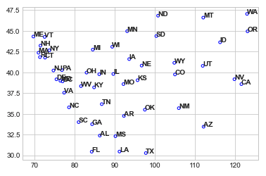
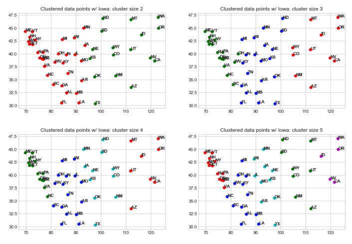
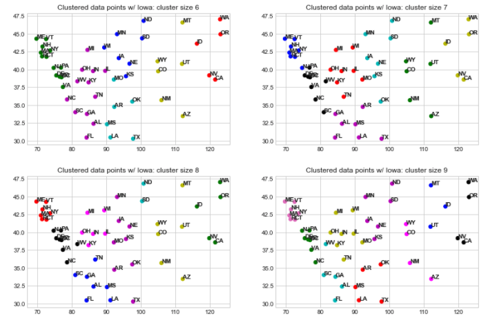
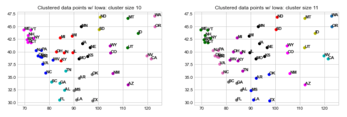
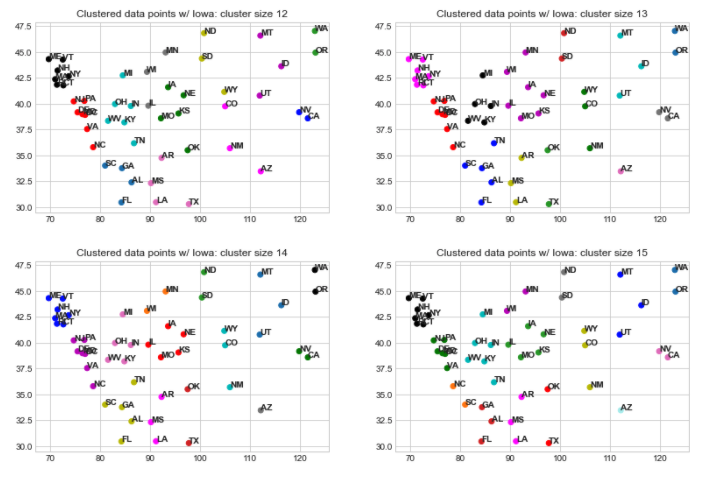

# travelingPolitician: A take on the Traveling Salesman Problem
[](https://www.python.org/)
[](https://lbesson.mit-license.org/)

## Table of Contents
* [Problem](problem)
* [Approach](#approach)
* [Technologies](#technologies)
* [Setup](#setup)

## Problem
Traveling Politician Problem:
Outline: Start at the capital of Iowa, want to travel through all states optimally by distance and end at Washington D.C.

Key Notes:
* Different from the Traveling Salesman problem in that we do not want to return to the start. 
* Different from optimal path algorithms such as Djikstra’s because we have to travel over every node.
* We are given a complete graph of 51 nodes (50 states plus D.C.).
* A naive solution would take 49! iterations (We know the start and end nodes)
* **Distances are tracked in miles**

Initial Thoughts:
1. Approach using clustering, breakdown to clusters and connect clusters as well as inner cluster.
2. Use state boundaries as the possible paths to explore when performing permutations.

Approach 1 seemed to minimize the problem more so that is the solution I implemented.

Outline of Code:
* Imports
* Basic name & input handling (locations of state capitals)
* Base functions (Input formatting, distance between states, calculating the n^th closest states)
* Plotting
* Plotting Clusters (w/o Hawaii and Alaska)
* Optimization functions (cluster formatting, cluster ordering, inner-cluster distance optimization, cluster connection optimization, path output)
* Optimal insertions of Alaska and Hawaii

Initial Assumptions:
* When performing the clustering, we leave Hawaii and Alaska out to prevent the two from being clusters individually.

## Approach
Inital Plot: Reversed United States
<p align="center"> 
  
</p>

Plots including clustering:
* Clustering was performed using K-Means clustering by coordinates.
<p align="center"> 
  
  
  
  
</p>

### Observations:
* We can see that for clusters 1-5, the split begins vertically. Multi-layered clusters occur from cluster 6 and onward.
* In clusters 13, 14, 15, the first individual state as a cluster occurs with Arizona.

To determine the order between clusters, I performed another permutative analysis over the number of clusters, disregarding the cluster that included Iowa (start node) and the cluster that included D.C. (end node).

Since I did not optimize through Held-Karp algorithm, we can observe the following runtimes:

| Cluster Size | Max Component | Cluster Size | Max Component |
|----------|-------------| ----------|-------------|
| 2 |  32 | 9 |    8   |
| 3 | 21 | 10 |  8 |
| 4 |    16  | 11 | 7 |
| 5 |  13 |  12 |    7   |
| 6 | 13 | 13 |  7 |
| 7 |   8  | 14 | 7 |
| 8 |   8  | 15 | 7 |

The tradeoff between component size and cluster size becomes most apparent at cluster size 7.
1. Within each cluster, we perform (Max Component - 1)! operations since we know the start node.
2. Between the clusters, we perform (Cluster Size - 2)! operations since we know the start and end clusters.

I examined cluster sizes of 7-12 to keep the permutation size under 10!.

### Analysis:
#### Paths without Hawaii and Alaska
Cluster size 7: 
* ['IA', 'KS', 'OK', 'NE', 'MN', 'SD', 'ND', 'ID', 'WA', 'OR', 'CA', 'NV', 'UT', 'MT', 'WY', 'CO', 'NM', 'AZ', 'TX', 'AR', 'MS', 'LA', 'AL', 'FL', 'GA', 'TN', 'KY', 'IN', 'IL', 'MO', 'WI', 'MI', 'OH', 'NJ', 'CT', 'RI', 'MA', 'NH', 'ME', 'VT', 'NY', 'PA', 'DE', 'MD', 'VA', 'NC', 'WV', 'SC', 'DC']
* Distance traveled: 12481.556954489908

Cluster size 8:
* ['IA', 'MN', 'NE', 'KS', 'MO', 'AR', 'OK', 'TX', 'NM', 'AZ', 'CO', 'WY', 'UT', 'MT', 'ID', 'NV', 'CA', 'OR', 'WA', 'ND', 'SD', 'WI', 'IL', 'IN', 'MI', 'OH', 'KY', 'TN', 'MS', 'LA', 'AL', 'FL', 'GA', 'SC', 'CT', 'RI', 'MA', 'NH', 'ME', 'VT', 'NY', 'NJ', 'PA', 'DE', 'MD', 'VA', 'NC', 'WV', 'DC']
* Distance traveled: 12380.665785460324

Cluster size 9:
* ['IA', 'KS', 'NE', 'MN', 'SD', 'ND', 'MT', 'ID', 'UT', 'NV', 'CA', 'OR', 'WA', 'WY', 'CO', 'AZ', 'NM', 'OK', 'TX', 'AR', 'MS', 'LA', 'AL', 'FL', 'GA', 'SC', 'WV', 'OH', 'IN', 'KY', 'TN', 'MO', 'IL', 'WI', 'MI', 'NY', 'VT', 'ME', 'NH', 'MA', 'RI', 'CT', 'NJ', 'PA', 'DE', 'MD', 'VA', 'NC', 'DC']
* Distance traveled: 11935.711327404602

Cluster size 10:
* ['IA', 'MO', 'KS', 'NE', 'MN', 'SD', 'ND', 'MT', 'ID', 'UT', 'NV', 'CA', 'OR', 'WA', 'WY', 'CO', 'AZ', 'NM', 'OK', 'TX', 'LA', 'MS', 'AR', 'TN', 'GA', 'AL', 'FL', 'SC', 'KY', 'IN', 'IL', 'WI', 'MI', 'OH', 'NY', 'VT', 'ME', 'NH', 'MA', 'RI', 'CT', 'NJ', 'PA', 'DE', 'MD', 'VA', 'NC', 'WV', 'DC']
* Distance traveled: 12047.958869039592

Cluster size 11:
* ['IA', 'NE', 'KS', 'MO', 'IL', 'WI', 'MN', 'SD', 'ND', 'MT', 'UT', 'ID', 'OR', 'WA', 'NV', 'CA', 'AZ', 'NM', 'CO', 'WY', 'OK', 'TX', 'AR', 'MS', 'LA', 'AL', 'FL', 'SC', 'GA', 'TN', 'KY', 'IN', 'MI', 'OH', 'WV', 'NY', 'VT', 'ME', 'NH', 'MA', 'RI', 'CT', 'NJ', 'PA', 'DE', 'MD', 'VA', 'NC', 'DC']
* Distance traveled: 11185.821676023299

Cluster size 12:
* ['IA', 'NE', 'KS', 'OK', 'MO', 'IL', 'WI', 'MN', 'SD', 'ND', 'WY', 'UT', 'MT', 'ID', 'OR', 'WA', 'NV', 'CA', 'AZ', 'NM', 'CO', 'TX', 'AR', 'MS', 'LA', 'AL', 'FL', 'SC', 'GA', 'TN', 'KY', 'IN', 'MI', 'OH', 'WV', 'NY', 'VT', 'ME', 'NH', 'MA', 'RI', 'CT', 'NJ', 'PA', 'DE', 'MD', 'VA', 'NC', 'DC']
* Distance traveled: 11651.032003958166

#### Paths with Hawaii and Alaska
Cluster size 7: 
* ['IA', 'KS', 'OK', 'NE', 'MN', 'SD', 'ND', 'ID', 'WA', 'OR', 'AK', 'HI', 'CA', 'NV', 'UT', 'MT', 'WY', 'CO', 'NM', 'AZ', 'TX', 'AR', 'MS', 'LA', 'AL', 'FL', 'GA', 'TN', 'KY', 'IN', 'IL', 'MO', 'WI', 'MI', 'OH', 'NJ', 'CT', 'RI', 'MA', 'NH', 'ME', 'VT', 'NY', 'PA', 'DE', 'MD', 'VA', 'NC', 'WV', 'SC', 'DC']
* Distance traveled: 18348.595379770297

Cluster size 8:
* ['IA', 'MN', 'NE', 'KS', 'MO', 'AR', 'OK', 'TX', 'NM', 'AZ', 'CO', 'WY', 'UT', 'MT', 'ID', 'NV', 'CA', 'HI', 'AK', 'OR', 'WA', 'ND', 'SD', 'WI', 'IL', 'IN', 'MI', 'OH', 'KY', 'TN', 'MS', 'LA', 'AL', 'FL', 'GA', 'SC', 'CT', 'RI', 'MA', 'NH', 'ME', 'VT', 'NY', 'NJ', 'PA', 'DE', 'MD', 'VA', 'NC', 'WV', 'DC']
* Distance traveled: 18247.704210740714

Cluster size 9:
* ['IA', 'KS', 'NE', 'MN', 'SD', 'ND', 'MT', 'ID', 'UT', 'NV', 'CA', 'HI', 'AK', 'OR', 'WA', 'WY', 'CO', 'AZ', 'NM', 'OK', 'TX', 'AR', 'MS', 'LA', 'AL', 'FL', 'GA', 'SC', 'WV', 'OH', 'IN', 'KY', 'TN', 'MO', 'IL', 'WI', 'MI', 'NY', 'VT', 'ME', 'NH', 'MA', 'RI', 'CT', 'NJ', 'PA', 'DE', 'MD', 'VA', 'NC', 'DC']
* Distance traveled: 17802.749752684995

Cluster size 10:
* ['IA', 'MO', 'KS', 'NE', 'MN', 'SD', 'ND', 'MT', 'ID', 'UT', 'NV', 'CA', 'HI', 'AK', 'OR', 'WA', 'WY', 'CO', 'AZ', 'NM', 'OK', 'TX', 'LA', 'MS', 'AR', 'TN', 'GA', 'AL', 'FL', 'SC', 'KY', 'IN', 'IL', 'WI', 'MI', 'OH', 'NY', 'VT', 'ME', 'NH', 'MA', 'RI', 'CT', 'NJ', 'PA', 'DE', 'MD', 'VA', 'NC', 'WV', 'DC']
* Distance traveled: 17914.997294319983

Cluster size 11:
* ['IA', 'NE', 'KS', 'MO', 'IL', 'WI', 'MN', 'SD', 'ND', 'MT', 'UT', 'ID', 'OR', 'WA', 'AK', 'HI', 'NV', 'CA', 'AZ', 'NM', 'CO', 'WY', 'OK', 'TX', 'AR', 'MS', 'LA', 'AL', 'FL', 'SC', 'GA', 'TN', 'KY', 'IN', 'MI', 'OH', 'WV', 'NY', 'VT', 'ME', 'NH', 'MA', 'RI', 'CT', 'NJ', 'PA', 'DE', 'MD', 'VA', 'NC', 'DC']
* Distance traveled: 16905.85597768493

Cluster size 12:
* ['IA', 'NE', 'KS', 'OK', 'MO', 'IL', 'WI', 'MN', 'SD', 'ND', 'WY', 'UT', 'MT', 'ID', 'OR', 'WA', 'NV', 'CA', 'AZ', 'NM', 'CO', 'TX', 'AR', 'MS', 'LA', 'AL', 'FL', 'SC', 'GA', 'TN', 'KY', 'IN', 'MI', 'OH', 'WV', 'NY', 'VT', 'ME', 'NH', 'MA', 'RI', 'CT', 'NJ', 'PA', 'DE', 'MD', 'VA', 'NC', 'DC']
* Distance traveled: 17371.0663056198

### Summarized Results
| Cluster Size | Distance w/o HI and AK | Distance w/ HI and AK |
|----------|-------------| ----------|
| 7 | 12481.556954489908 | 18348.595379770297 |
| 8 | 12380.665785460324 | 18247.704210740714 |
| 9 | 11935.711327404602 | 17802.749752684995 |
| 10 | 12047.958869039592 | 17914.997294319983 |
| 11 | 11185.821676023299 | 16905.85597768493 |
| 12 | 11651.032003958166 | 17371.0663056198 |

We can observe that the optimal clustering is with **cluster size 11** with a total distance traveled of **16905.855978 miles**.

The optimal path is:
* ['IA', 'NE', 'KS', 'MO', 'IL', 'WI', 'MN', 
* 'SD', 'ND', 
* 'MT', 'UT', 'ID', 
* 'OR', 'WA', 
* 'AK', 'HI', 
* 'NV', 'CA', 
* 'AZ', 'NM', 'CO', 'WY', 
* 'OK', 'TX', 'AR', 'MS', 'LA', 
* 'AL', 'FL', 'SC', 'GA', 
* 'TN', 'KY', 'IN', 'MI', 'OH', 'WV', 
* 'NY', 'VT', 'ME', 'NH', 'MA', 'RI', 'CT', 
* 'NJ', 'PA', 'DE', 'MD', 'VA', 'NC', 'DC'] 

### Computational Time Analysis:
Permutations w/ Hawaii and Alaska
* Refer back to the runtime table with specific regarding component sizes per cluster size.
* Inner-Cluster Iterations calculated by obtaining a list of states in each cluster
  - If the cluster is the last one including D.C. (we know start and end nodes), we add (numElements - 2)! to the iteration count
  - Else, we add (numElements - 1)! to the iteration count

| Cluster Size | Computation Time (seconds) | Inner-Cluster Iterations | Cluster Iterations | Total Iterations |
| ------------ | -------------------------- | ------------------------ | ------------------ | ---------------- |
| 7            | 32.465                     | 12384                    | 5! = 120           | 12504            |
| 8            | 25.109                     | 7465                     | 6! = 720           | 8185             |
| 9            | 28.364                     | 6062                     | 7! = 5040          | 11102            |
| 10           | 145.888                    | 1647                     | 8! = 40320         | 41967            |
| 11           | 1498.054                   | 1721                     | 9! = 362880        | 364601           |
| 12           | 15068.588                  | 1006                     | 10! = 3628800      | 3629806          |

The approximation for computation time by total iterations is:
<div align="center">Computation Time = 0.004156704 * Total Iterations - 18.449704893</div>

We can see that as the cluster size grows, the total iterations is more dependent on iterations from between clusters. Therefore, for a large number of clusters, 
<div align="center">Total Iterations ≈ (Cluster Size - 2)!</div>

Permutations w/ Hawaii and Alaska
* I iterated over all possible insertions of Hawaii and Alaska into a list of 49 elements.
* Given constraints, Iowa must be first and D.C. must be last, there are 48 * 49 = 2352 iterations necessary to be performed
* Time process took on average **42.861 seconds** per round

### Conclusions:
* Through analysis, it is possible to break this problem down and perform manageable analysis.
* The longest execution time took about 4 hours for cluster size 12 which demonstrates the factorial growth in execution time required and did not result in the optimal solution. This shows that a tradeoff between speed does not correlate to any increases in accuracy.
* I am unsure if my solution is optimal and I am unsure if there is a way to prove that clustering would result in the optimal solution.

## Technologies
Project is created with:
* Python 3.6
* geopy: For distance calculations by coordinate locations.
	
## Setup
The following instructions are for Mac OS.

Follow the instructions and run the commands in Terminal:

Step 0: cd into a folder that you want to store the code/files stored
```
$ cd /Users/{Insert username}/Documents/{Whatever path you want to use}
```
Step 1: Clone the repository
```
$ git clone https://github.com/awx1/travelingPolitician.git
```

Install packages
```
$pip install geopy
$pip install sklearn
```
